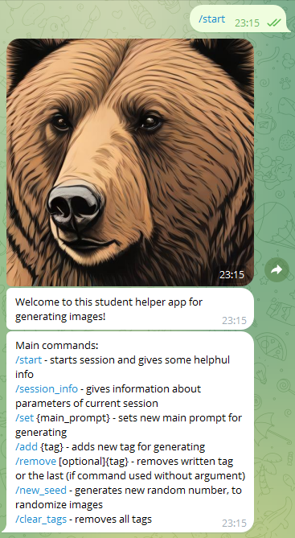
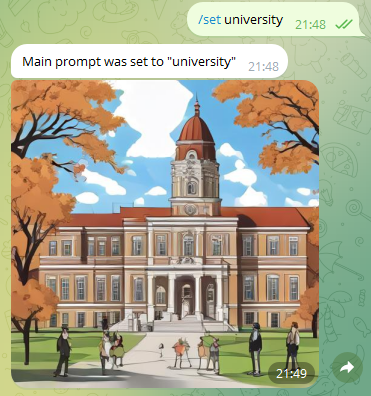

# Генератор изображений для помощи студентам в создании презентаций и статей

Данное приложение было создано с целью помощи студентам в создании презентаций.

Приложение является Telegram ботом и решает данную проблему с помощью использования нейросети для генерации изображений SDXL-Turbo. 

## Начало работы

Для запуска данного приложения локально необходимо:
1. Установить библиотеки из файла requirements.txt 
<code>pip install -r requirements.txt</code>
2. Установить отдельно PyTorch (https://pytorch.org/get-started/locally/)
3. Создать своего телеграм бота, ознакомиться с инструкцией можно по ссылке - https://core.telegram.org/bots/tutorial. В результате создания бота будет получен токен вида <code>4839574812:AAFD39kkdpWt3ywyRZergyOLMaJhac60qc</code>
4. Создать в папке src файл config.cfg и добавить в него строчку <code>token=полученный:токен</code>
5. Запустить скрипт [bot.py](/src/bot.py)
6. Открыть ранее созданного бота в телеграме и начать использовать

## Использование

Начинать использование бота стоит с выполнения команды /start, данная команда задаст необходимые настройки сессии клиента, а также опишет информацию о том, какие команды можно использовать.

**Описание команд без параметров:**

1. /start - запускает сессию и дает вспомогательную информацию
2. /session_info - показывает информацию о текущей сессии

    

    Main prompt - описание изображения
    Tags - доп. тэги для более детального описания вида изображения
    Random seed - случайное число, которое используется для генерации изображения

3. /new_seed - если есть необходимость координально поменять изображения (например есть артефакты в изображении), можно сгенерировать новый Random seed данной командой.

**Описание команд с параметрами:**

1. /set {main_prompt} - в данной команде заместо {main_prompt} необходимо вставить свой текст на английском с описанием того, что нужно сгенерировать. Команда задает Main prompt.

    
2. /add {tag} - в данной команде заместо {tag} необходимо вставить свой текст на английском с описанием доп. стиля того, что нужно сгенерировать. Команда добавит новый тэг в общий список.

    

3. /remove {tag} - данная команда позволяет удалить тэг из списка тэгов. Если тэг не был прописан, то команда удалит последний тэг в списке.

**Важные уточнения:**

- Используется модель SDXL-Turbo, данная модель работает крайне быстро в сравнении с обычной SDXL, но за это теряется качество. Поэтому нередко появляются артефакты, для их решения слдует пробовать менять сид, тэги или основное описание.
- Вся модель и приложение работает только на английском языке

## Команда

Команда 31. 
Тема - персональный помощник студентов. 
Участники - Шешин Николай Андреевич